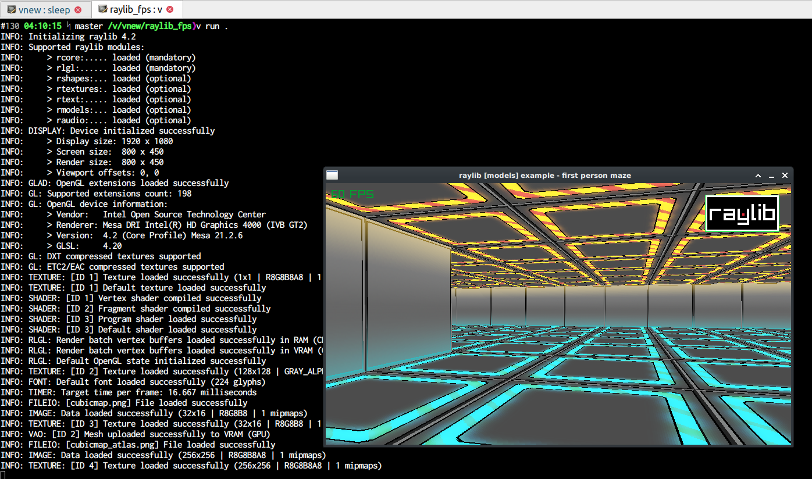

This is just a simple port of
[Raylib's First Person Maze example](https://github.com/raysan5/raylib/blob/master/examples/models/models_first_person_maze.c)
using the [V language](https://github.com/vlang/v) .

Many thanks to @raysan5 for the amazing Raylib, and to @irishgreencitrus for his excellent V wrapper.

